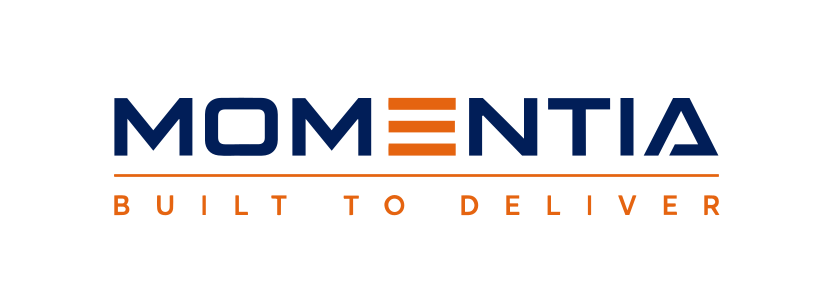

<div align="center">

  

  # Momentia LLC — Web Corporativa Oficial
  **Built to Deliver · Texas Retail & Distribution**

  <p align="center">
    Plataforma web B2B de alto rendimiento, modular y accesible para alianzas comerciales con fabricantes y distribuidores.
  </p>

  <p align="center">
    <a href="https://jotajota0607.github.io/Momentia/">
      
    </a>
    
    
  </p>

  <p align="center">
    
    
    
    
    
  </p>

  **[🌐 Ver Sitio Web en Producción](https://jotajota0607.github.io/Momentia/)**

</div>

---

## 📌 Visión General

**Momentia LLC** es una empresa de distribución minorista con base en **Texas, Estados Unidos**, orientada a conectar productos de alta calidad con consumidores a través de abastecimiento profesional, gestión de inventario y operaciones de retail multicanal.

Este repositorio contiene el código fuente de la página web corporativa, refactorizada y optimizada bajo una **arquitectura web moderna, modular y sin dependencias pesadas**, garantizando tiempos de carga casi instantáneos y una experiencia visual impecable en cualquier dispositivo.

---

## ⚡ Características Principales

- **Rendimiento Extremo (Web Performance)**:
  - Reducción del tamaño del HTML en un **97.2%** (de 875 KB en el monolítico original a solo 24 KB).
  - Eliminación total de imágenes incrustadas en Base64; migración a formatos modernos **WebP** y gráficos vectoriales **SVG**.
  - `preconnect` y fuentes optimizadas sin bloqueo de renderizado (*Render-Blocking Resources*).

- **Diseño 100% Responsivo y Fluido**:
  - Enfoque *Mobile-First* verificado en resoluciones móviles estándar (375px, 414px, 768px) y pantallas de escritorio 4K.
  - Flujo adaptativo para procesos de distribución: diagrama SVG continuo en escritorio y tarjetas verticales apiladas con marcadores chevron en móviles (0 scrollbars horizontales).

- **Identidad de Marca Oficial Vectorizada**:
  - Logotipos vectoriales nativos en SVG puro con escalado nítido infinito: versión azul corporativo para cabecera clara (`logo-momentia.svg`) y versión blanca en fondo transparente para el pie de página (`logo-momentia-white.svg`).
  - Favicon multirresolución transparente anti-caché (`.ico` con capas de 16, 32 y 48 px).

- **Formulario B2B de Alianzas Comerciales**:
  - Formulario nativo con validación de accesibilidad (`aria-invalid`), estructuración automática de correo y botón de respaldo para copiado al portapapeles.
  - Contacto oficial: `partnerships@momentiallc.com`.

- **SEO y Metadatos Sociales Completos**:
  - Integración de Open Graph y Twitter Cards con imagen de previsualización corporativa dedicada (`og-preview.jpg` de 1200 × 630 px) para enlaces en WhatsApp, Telegram y LinkedIn.
  - Marcado estructurado **Schema.org JSON-LD** institucional para motores de búsqueda.

---

## 📁 Estructura del Código

```text
├── assets/
│   ├── icons/            # Favicon universal multirresolución
│   └── images/           # Logotipos SVG, fotografías WebP y banner OG
├── css/
│   ├── base.css          # Reset, tipografía, variables y estilos globales
│   ├── main.css          # Punto de entrada único que importa los módulos
│   ├── layout/
│   │   ├── header.css    # Cabecera fija con efecto backdrop blur y navegación
│   │   └── footer.css    # Pie de página institucional y copyright
│   └── components/
│       ├── hero.css        # Sección principal con degradado y propuesta de valor
│       ├── intro.css       # Franja de presentación y principios de crecimiento
│       ├── about.css       # Misión, visión y pilares corporativos
│       ├── suppliers.css   # Flujo de distribución y tarjetas de servicio
│       ├── why.css         # Diferenciadores y fotografía operativa
│       ├── leadership.css  # Cita testimonial y foto institucional
│       ├── compliance.css  # Credenciales de registro y cumplimiento comercial
│       └── contact.css     # Formulario de prospección B2B y canales directos
├── js/
│   ├── main.js           # Inicialización y control principal
│   └── modules/
│       ├── navigation.js # Menú móvil hamburguesa accesible con bloqueo de scroll
│       └── form.js       # Validación, armado de correo y portapapeles
├── index.html            # Estructura semántica HTML5 principal
└── README.md             # Documentación técnica del proyecto
```

---

## 🎨 Paleta de Color Corporativa

| Muestra | Nombre | Valor HEX | Uso Principal |
| :---: | :--- | :---: | :--- |
|  | **Navy Corporativo** | `#011E59` | Color institucional primario, cabeceras, títulos y contrastes |
|  | **Naranja Acento** | `#F26A0C` | Botones de llamado a la acción (CTA), viñetas y detalles de marca |
|  | **Blanco Puro** | `#FFFFFF` | Fondos de lectura limpios y textos sobre fondo oscuro |
|  | **Gris Niebla (Fog)**| `#EEF1F6` | Fondos de secciones alternas y tarjetas informativas |
|  | **Pizarra (Slate)** | `#3B4658` | Tipografía principal de lectura y párrafos |
|  | **Pizarra Claro** | `#778498` | Subtítulos, metadatos y sobretítulos de sección |

---

## 💻 Ejecución y Desarrollo Local

Para visualizar o probar el proyecto en tu máquina local:

```bash
# Opción 1: Servidor ligero con Python
python -m http.server 3000

# Opción 2: Con Node.js (npx serve)
npx serve .

# Opción 3: Extensión "Live Server" de Visual Studio Code
# Clic derecho en index.html -> "Open with Live Server"
```

Abre en tu navegador: **`http://localhost:3000`**

---

## 🚀 Despliegue en Producción

El proyecto se despliega automáticamente en **GitHub Pages** al enviar cambios a la rama `main`:

- **URL de Producción**: [https://jotajota0607.github.io/Momentia/](https://jotajota0607.github.io/Momentia/)
- **Rama de Despliegue**: `main`

---

## 🏢 Contacto Institucional

**Momentia LLC**  
Texas, United States  
📧 Correo: [partnerships@momentiallc.com](mailto:partnerships@momentiallc.com)  
🌐 Sitio Web: [https://jotajota0607.github.io/Momentia/](https://jotajota0607.github.io/Momentia/)

---

<div align="center">
  <small>© 2026 Momentia LLC. All rights reserved. Built to Deliver.</small>
</div>
